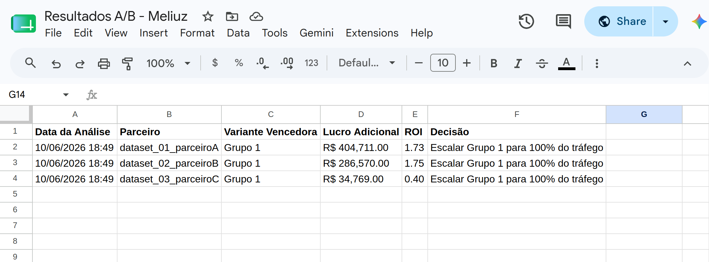
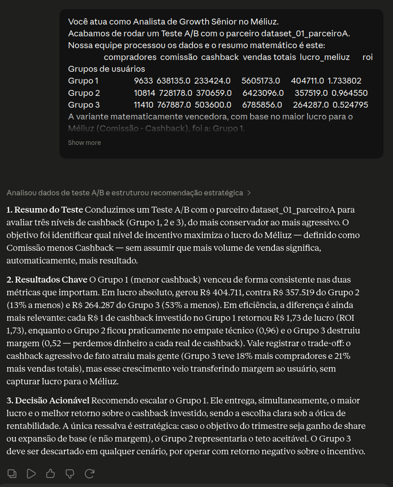
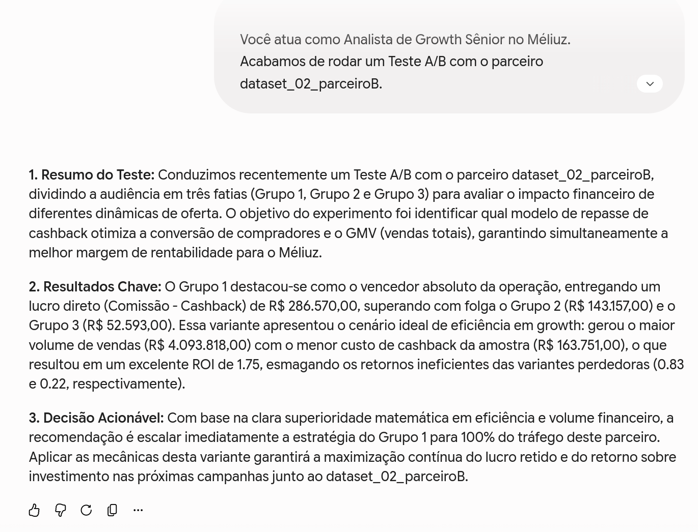
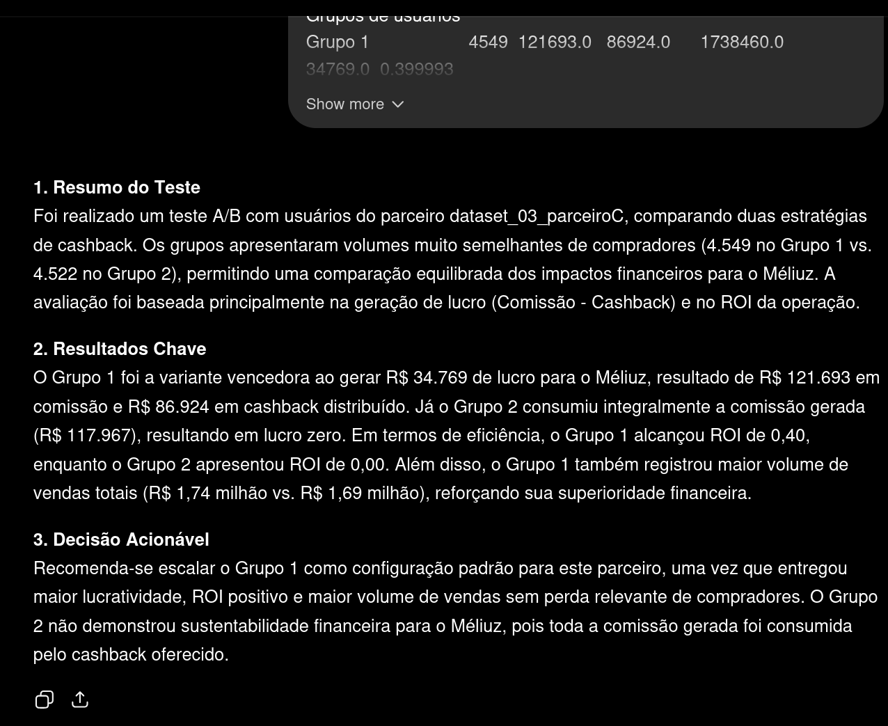

# 🚀 Méliuz Growth - TESTE TÉCNICO

Este projeto, para a vaga de estagiário em growth, tem como objetivo automatizar a análise financeira de resultados de Testes A/B para múltiplos parceiros.

O pipeline calcula a variante vencedora com foco no **Lucro Real e ROI** gerados para o Méliuz, envia os resultados diretamente para uma planilha na nuvem e gera prompts prontos para relatórios gerenciais por IA.

---

## 📸 Demonstração do Projeto

Abaixo estão algumas imagens do funcionamento do sistema:

<p align="center">

<br>
<em>Legenda 1: Planilha onde os resultados são enviados</em>
</p>

<p align="center">

<br>
<em>Legenda 2: Analise do dataset 1 pelo Claude</em>
</p>

<p align="center">

<br>
<em>Legenda 3: Analise do dataset 2 pelo Gemini</em>
</p>

<p align="center">

<br>
<em>Legenda 4: Análise do dataset 3 pelo ChatGPT</em>
</p>

---

## 🛠 Funcionalidades Principais

1. **🚀 Processamento em Lote Automatizado:** O script lê a pasta com os datasets e processa dezenas de testes A/B de uma só vez.
2. **🧹 Limpeza e Formatação Inteligente:** Limpa as colunas financeiras e converte textos para valores decimais calculáveis.
3. **📊 Decisão Orientada a Lucro:** Agrupa os dados e calcula matematicamente o vencedor do teste focando no **Lucro** (Comissão - Cashback) e **ROI**.
4. **🤖 Integração com IA:** Gera automaticamente arquivos de texto na pasta `relatorios/` contendo prompts prontos para IA.
5. **☁️ Integração com Google Sheets:** Conecta de forma segura com o Google Drive/Sheets e alimenta uma planilha em tempo real.

---

## 📁 Estrutura de Pastas

```text
📦 Meliuz-Growth-Test
┣ 📂 datasets/ # Coloque aqui todos os arquivos .csv exportados dos testes A/B
┣ 📂 relatorios/ # Prompts prontos para a Inteligência Artificial
┣ 📂 scripts/
┃ ┗ 📜 analisador_ab.py # O script principal
┣ 📜 credentials.json #Não irá aparecer, mas é a chave de acesso para a planilha do Google Sheets
┣ 📜 .gitignore # Protege arquivos sensíveis
┗ 📜 README.md
```

---

## ⚙️ Como executar o projeto

### 1. Pré-requisitos e segurança
Como este projeto se conecta diretamente a uma planilha na nuvem, as chaves de acesso (`credentials.json`) **não foram enviadas para o GitHub**. Entretanto é possível testar o código rodando na própria máquina.

### 2. Ative a máquina virtual
Os pacotes como `pandas` e `gspread` foram instalados de forma isolada.
Para rodar, basta executar esse comando no terminal a partir da pasta raiz do projeto:

```bash
.venv/bin/python scripts/analisador_ab.py
```
